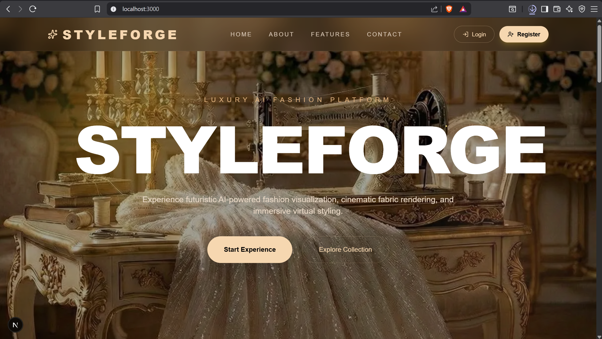
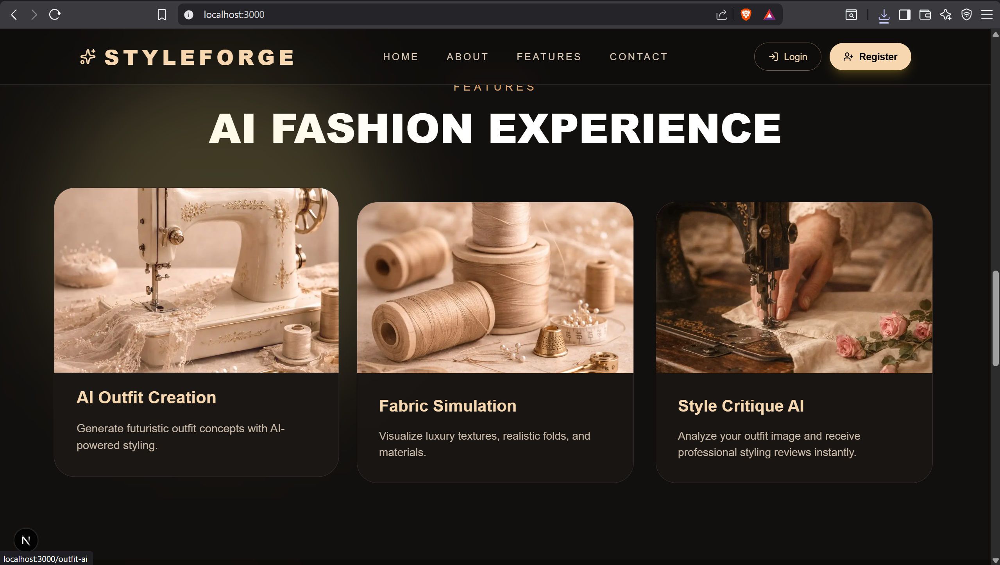
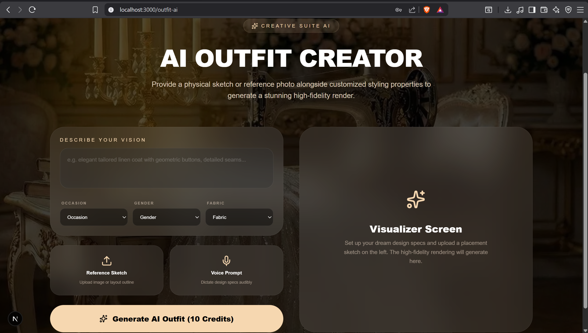
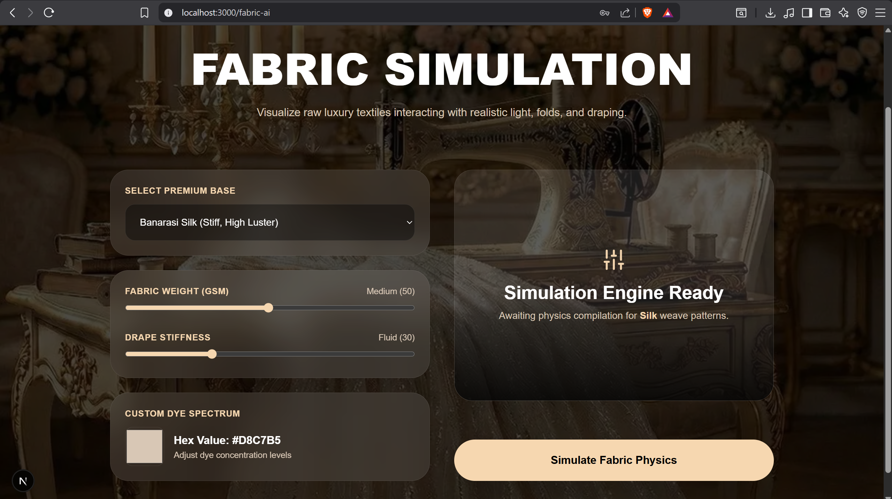
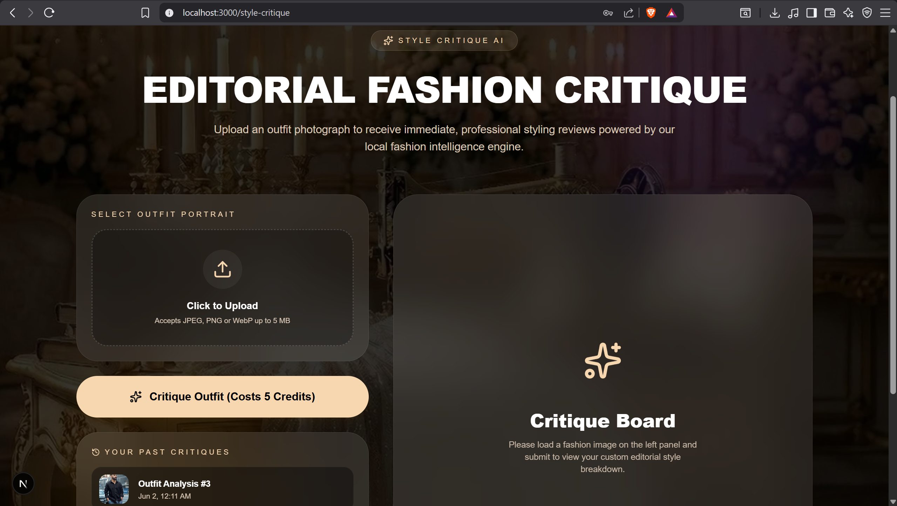
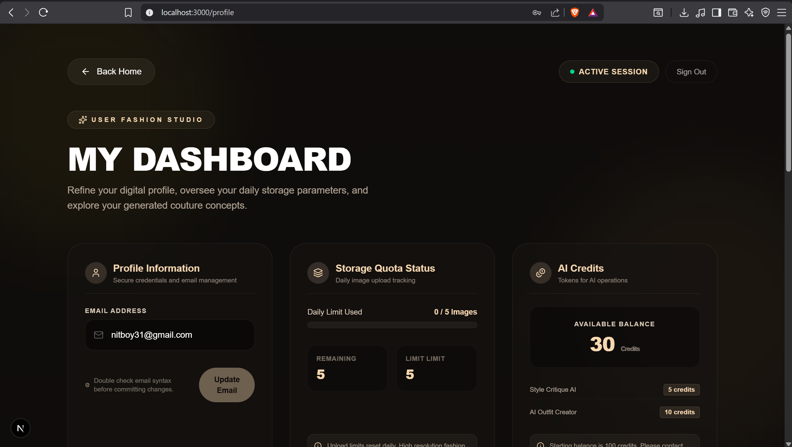

<div align="center">


# ✨ StyleForge

### *Where Artificial Intelligence Meets High Fashion*

**An AI-powered fashion platform that critiques your outfits, simulates fabrics, and generates apparel designs - all from a single, beautifully crafted interface.**

<br/>

[](https://nextjs.org/)
[](https://fastapi.tiangolo.com/)
[](https://python.org/)
[](https://react.dev/)
[](https://postgresql.org/)
[](https://docker.com/)
[](https://tailwindcss.com/)

<br/>

[🖼️ Screenshots](#-screenshots) · [🎬 Demo Videos](#-demo-videos) · [🚀 Quick Start](#-quick-start) · [🧠 Features](#-features) · [🏗️ Architecture](#️-architecture) · [📡 API Docs](#-api-documentation) · [📄 Dissertation](#-research--dissertation)

---

</div>

## 🌟 What is StyleForge?

StyleForge is a full-stack, AI-driven fashion platform built for the modern era. Upload an outfit photo and receive a **sharp, editorial-style critique** from an elite AI fashion director. Simulate fabric physics in real-time. Generate entirely new apparel concepts from text prompts. All powered by a robust **microservices backend** and a sleek **Next.js 16** frontend.

> *StyleForge turns AI into your personal Creative Director.*

---

## 🖼️ Screenshots

### Home & Landing

<div align="center">
  
  <p><em>The StyleForge landing page - animated hero section showcasing the platform's AI fashion capabilities</em></p>
</div>

<br/>

### Platform Features

<div align="center">
  
  <p><em>Feature overview - Style Critique, Fabric Simulation, and AI Outfit Generation at a glance</em></p>
</div>

<br/>

### AI Tools in Action

<div align="center">
  <table>
    <tr>
      <td align="center" width="50%">
        
        <br/><sub><b>🎨 AI Outfit Generation</b> - Text-to-fashion design via Diffusion model</sub>
      </td>
      <td align="center" width="50%">
        
        <br/><sub><b>🧵 Fabric Simulation</b> - Real-time physics-based fabric drape rendering</sub>
      </td>
    </tr>
    <tr>
      <td align="center" width="50%">
        
        <br/><sub><b>🤖 AI Style Critique</b> - Editorial-grade outfit analysis powered by Qwen 3.5:9b</sub>
      </td>
      <td align="center" width="50%">
        
        <br/><sub><b>👤 User Dashboard</b> - Credit balance, generation history, and saved images</sub>
      </td>
    </tr>
  </table>
</div>

> 📁 Place all screenshots in `docs/screenshots/` at the repository root.

---

## 🎬 Demo Videos

### 🎨 AI Fashion Design — Outfit Generation

https://github.com/thatquietkid/styleforge/raw/main/docs/videos/AI_Fashion_Design.mp4

<details>
<summary>📋 What this demo shows</summary>

- Entering a natural-language outfit prompt (e.g. *"oversized sage linen blazer, wide-leg cream trousers, minimalist loafers"*)
- Credit deduction (10 credits) and live progress indicator
- The generated apparel design rendered by the Colab inference backend
- Saving the result to the personal image gallery

</details>

---

### 🧵 Fabric Simulation — Physics-Based Drape

https://github.com/thatquietkid/styleforge/raw/main/docs/videos/fabric_sim.mp4

<details>
<summary>📋 What this demo shows</summary>

- Selecting a fabric type (Silk, Velvet, Denim, Cotton, Wool)
- Adjusting weight, stiffness, and color parameters with real-time sliders
- Generating a physics-based fabric drape render
- Viewing and saving the base64-rendered simulation output

</details>

---

### 🤖 AI Style Critique — Editorial Fashion Analysis

https://github.com/thatquietkid/styleforge/raw/main/docs/videos/style-crit.mp4

<details>
<summary>📋 What this demo shows</summary>

- Uploading an outfit photo (drag & drop)
- Credit deduction (5 credits) and submission to the Ollama/Qwen backend
- Receiving the structured markdown critique:
  - **Core Issue** — the single biggest flaw in the outfit
  - **Aesthetic Breakdown** — color harmony, fit & silhouette, textures
  - **Execution Plan** — actionable garment swaps, tailoring tips, accessory refinements
- Critique persisted to user history for future reference

</details>

---

## ✨ Features

### 🤖 AI-Powered Fashion Intelligence
- **Style Critique** — Upload an outfit image and receive a structured editorial breakdown: core issues, aesthetic analysis (color harmony, fit & silhouette, textures), and an actionable execution plan. Powered by **Ollama + Qwen 3.5:9b**.
- **Fabric Simulation** — Simulate how different fabrics (Silk, Velvet, Denim, etc.) drape and behave with real-time parameter controls (weight, stiffness, color). Results rendered and saved as base64 images.
- **Outfit Generation** — Generate entirely new apparel designs from text prompts via a Colab/ComfyUI inference backend.
- **Virtual Try-On** *(coming soon)* — See generated outfits on a model.

### 🔐 Authentication & Identity
- **JWT-based auth** with secure token management
- **Google OAuth 2.0** single sign-on
- **OTP email login** via SMTP (passwordless flow)
- Role-based access control: `user`, `tailor`, `admin`

### 💎 Credit System
- Every user starts with **100 free credits**
- Style Critique costs **5 credits** · Image Generation costs **10 credits**
- Full audit trail of all credit transactions

### 📊 Analytics & Audit
- Structured event tracking across all services
- Searchable audit log for debugging and compliance
- Per-user analytics dashboard

### 🗂️ Image Catalog
- Upload and manage your personal fashion images
- Daily quota system (configurable)
- Serves generated and uploaded images via static file hosting

---

## 🏗️ Architecture

StyleForge is built as a **microservices monorepo** with a unified API gateway as the single entry point.

```
Styleforge/
├── styleforge-frontend/        # Next.js 16 + React 19 + Tailwind v4
│   └── src/app/
│       ├── style-critique/     # AI outfit critique UI
│       ├── fabric-ai/          # Fabric simulation UI
│       ├── outfit-ai/          # Outfit generation UI
│       ├── profile/            # User dashboard & credits
│       ├── login/ register/    # Auth flows (JWT, Google, OTP)
│       └── ...
│
└── styleforge-backend/         # Python FastAPI microservices
    ├── gateway/                # 🚪 Unified API Gateway (port 8000)
    ├── auth/                   # 🔐 Auth service (port 8001)
    ├── catalog/                # 🗂️  Image catalog (port 8002)
    ├── orders/                 # 📦 Orders service (port 8003)
    ├── analytics/              # 📊 Analytics service (port 8004)
    ├── audit/                  # 🔍 Audit log service (port 8005)
    ├── genai/                  # 🤖 AI/ML service (port 8006)
    ├── common/                 # Shared models, DB, config
    ├── alembic/                # Database migrations
    └── docker-compose.yml      # Full stack orchestration
```

### Service Map

| Service    | Port | Responsibility |
|------------|------|----------------|
| **Gateway**    | `8000` | JWT validation, request routing, OpenAPI docs |
| **Auth**       | `8001` | Register, login, Google OAuth, OTP, profile |
| **Catalog**    | `8002` | Image upload, management, quota enforcement |
| **Orders**     | `8003` | Order lifecycle management |
| **Analytics**  | `8004` | Event tracking & aggregated stats |
| **Audit**      | `8005` | Structured log ingestion & search |
| **GenAI**      | `8006` | Style critique (Ollama), fabric sim, generation |

---

## 🛠️ Tech Stack

| Layer | Technology |
|-------|-----------|
| **Frontend** | Next.js 16, React 19, Tailwind CSS v4, Framer Motion, Lucide React |
| **Backend** | FastAPI 0.136, Python 3.13, SQLAlchemy 2.0, Alembic, Pydantic v2 |
| **Database** | PostgreSQL 15 (asyncpg driver) |
| **AI / ML** | Ollama (Qwen 3.5:9b), Google Colab / ComfyUI for generation |
| **Auth** | JWT (PyJWT), Google OAuth 2.0, OTP via SMTP |
| **Infra** | Docker Compose, Uvicorn, aiosmtplib, httpx |
| **Testing** | pytest, pytest-asyncio |

---

## 🚀 Quick Start

### Prerequisites

- **Docker & Docker Compose** installed
- **Node.js 20+** and **npm**
- **Ollama** running locally with `qwen3.5:9b` pulled (`ollama pull qwen3.5:9b`)
- A Google Cloud project with OAuth credentials (optional, for Google login)

### 1. Clone the Repository

```bash
git clone https://github.com/thatquietkid/styleforge.git
cd styleforge
```

### 2. Start the Backend

```bash
cd styleforge-backend

# Copy and configure environment variables
cp .env.example .env
# Edit .env with your JWT_SECRET, Google OAuth credentials, SMTP config, etc.

# Launch all services
docker compose up --build
```

The API gateway will be live at **http://localhost:8000**  
Interactive API docs at **http://localhost:8000/docs**

### 3. Start the Frontend

```bash
cd styleforge-frontend

# Install dependencies
npm install

# Configure environment
echo "NEXT_PUBLIC_AUTH_API_URL=http://localhost:8000" > .env.local

# Start development server
npm run dev
```

The app will be live at **http://localhost:3000**

---

## 📡 API Documentation

Once the backend is running, full interactive API documentation is available at:

- **Swagger UI** → `http://localhost:8000/docs`
- **ReDoc** → `http://localhost:8000/redoc`

See [`styleforge-backend/API_REFERENCE.md`](./styleforge-backend/API_REFERENCE.md) for the full endpoint reference.

---

## 🗄️ Database Schema

Key entities managed via SQLAlchemy + Alembic migrations:

| Model | Description |
|-------|-------------|
| `User` | Accounts with JWT auth, Google OAuth, roles, and credit balance |
| `OTPRecord` | Hashed OTP tokens for passwordless email login |
| `Image` | Uploaded and AI-generated images per user |
| `ImageQuota` | Daily upload quota tracking |
| `StyleCritique` | Persisted AI critique responses (markdown) |
| `FabricSimulation` | Fabric sim inputs + rendered base64 output |
| `CreditTransaction` | Full audit trail of all credit movements |
| `AnalyticsEvent` | Service-level event tracking |
| `AuditLog` | Structured operational audit logs |

---

## ⚙️ Environment Variables

### Backend (`.env`)

| Variable | Description |
|----------|-------------|
| `POSTGRES_URL` | PostgreSQL connection string |
| `JWT_SECRET` | Secret key for JWT signing |
| `GOOGLE_CLIENT_ID` / `GOOGLE_CLIENT_SECRET` | Google OAuth credentials |
| `SMTP_HOST` / `SMTP_USER` / `SMTP_PASS` | Email config for OTP |
| `OLLAMA_BASE_URL` | Local Ollama endpoint |
| `OLLAMA_MODEL` | Model name (e.g. `qwen3.5:9b`) |
| `COLAB_URL` | Ngrok URL of your Colab inference backend |
| `NEW_USER_CREDITS` | Credits granted on signup (default: `100`) |
| `STYLE_CRITIQUE_CREDITS` | Credits per critique (default: `5`) |
| `IMAGE_GENERATION_CREDITS` | Credits per generation (default: `10`) |

### Frontend (`.env.local`)

| Variable | Description |
|----------|-------------|
| `NEXT_PUBLIC_AUTH_API_URL` | Backend gateway URL (e.g. `http://localhost:8000`) |

---

## 🧪 Testing

```bash
cd styleforge-backend

# Run all tests
pytest

# Run specific test suite
pytest tests/test_genai.py -v
pytest tests/test_auth.py -v
```

---

## 📄 Research & Dissertation

This platform was developed as part of a final-year undergraduate dissertation in Software Engineering. The full academic report covers the system design, AI pipeline architecture, evaluation methodology, and findings in depth.

<div align="center">

[](./Dissertation.pdf)

</div>

The dissertation covers:

- **Literature Review** — Virtual try-on systems, diffusion models, ControlNet, LoRA fine-tuning, and AI-assisted fashion
- **System Design** — Microservices architecture decisions, database schema design, and the AI pipeline
- **Implementation** — Full-stack development with FastAPI, Next.js, and local LLM inference via Ollama
- **AI Pipeline** — Mask quality as the highest-leverage variable in virtual try-on; evaluation of Qwen 3.5:9b for style critique
- **Evaluation** — Quantitative and qualitative assessment of generation quality and system performance
- **Reflections** — Retrospective improvements: earlier adoption of purpose-built try-on models, investment in evaluation infrastructure, and Triton Inference Server

---

## 📁 Repository Structure

```
styleforge/
├── README.md                    ← You are here
├── Dissertation.pdf             ← Full academic report
├── docs/
│   ├── screenshots/
│   │   ├── home.png
│   │   ├── features.png
│   │   ├── ai-outfit.png
│   │   ├── dash1.png
│   │   ├── fabric-sim.png
│   │   └── fashion-critique.png
│   └── videos/
│       ├── AI_Fashion_Design.mp4
│       ├── fabric_sim.mp4
│       └── style-crit.mp4
├── styleforge-frontend/
│   ├── README.md                ← Frontend-specific docs
│   └── ...
└── styleforge-backend/
    ├── README.md                ← Backend-specific docs
    └── ...
```

---

## 🤝 Contributing

Contributions are welcome! Please:

1. Fork the repository
2. Create a feature branch: `git checkout -b feature/your-feature`
3. Commit your changes: `git commit -m 'feat: add your feature'`
4. Push to the branch: `git push origin feature/your-feature`
5. Open a Pull Request

---

## 📄 License

This project is licensed under the [MIT License](./LICENSE). See the `LICENSE` file for details.

---

<div align="center">

**Built with ❤️ and a passion for fashion × technology**

*StyleForge — Dress smarter. Create boldly.*

</div>